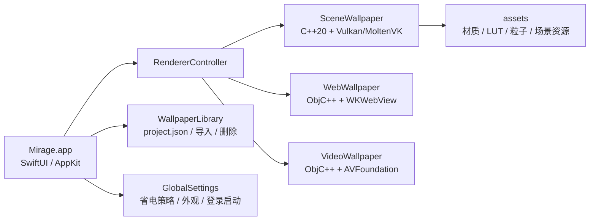

<p align="center">
  
</p>

<h1 align="center">Mirage Wallpaper</h1>

<p align="center">
  一款面向 macOS 的原生动态壁纸引擎，支持视频、网页与场景类壁纸。
</p>

<p align="center">
  
  
  
  
  
</p>

## 项目简介

Mirage Wallpaper 是一个 macOS 动态壁纸项目。它用 SwiftUI 构建主应用界面，并把不同类型的壁纸渲染拆分为独立子进程：视频壁纸交给 AVFoundation，网页壁纸交给 WKWebView，场景壁纸交给 C++20 + Vulkan/MoltenVK 渲染引擎。

项目目标不是做一个简单播放器，而是提供一套接近桌面级壁纸管理器的体验：壁纸库、搜索筛选、导入、预览、运行时属性调节、多显示器覆盖、系统托盘控制、自动省电策略，以及对 Wallpaper Engine 风格 `project.json` 包的兼容读取。

> 当前项目处于持续开发阶段。核心渲染、导入、筛选、运行时控制与打包流程已经具备；播放列表、收藏、创意工坊浏览等入口仍在完善中。

## 功能亮点

| 模块 | 能力 |
| --- | --- |
| 壁纸类型 | 支持 `scene`、`web`、`video` 三类壁纸包 |
| 视频渲染 | 基于 AVFoundation 循环播放，支持音量、静音、填充、适应、拉伸 |
| 网页渲染 | 基于 WKWebView，支持用户属性注入、音频频谱开关、桌面鼠标事件转发 |
| 场景渲染 | 基于 Vulkan/MoltenVK 与自研 SceneRenderer，支持 `scene.pkg` / `scene.json`、材质、粒子、LUT、渲染图 |
| 壁纸库 | 读取 Steam Workshop 默认目录与本地导入目录，支持拖放导入 |
| 管理体验 | 搜索、按名称/分级/大小排序、类型/来源/标签/分级筛选、标签编辑 |
| 运行时控制 | 音量、速度、帧率、静音、暂停、停止、覆盖到所有显示器 |
| 预设 | 壁纸属性可导入/导出为 JSON 预设 |
| 系统集成 | 菜单栏控制、登录启动、深浅色外观、桌面占位图恢复 |
| 省电策略 | 可在全屏应用、其他应用播放音频、显示器休眠、电池供电等场景下保持运行、静音、暂停或停止 |
| 安全提示 | 网页壁纸首次应用前会触发信任确认，降低未知网页内容的误用风险 |

## 支持的壁纸包

Mirage 以壁纸目录中的 `project.json` 作为入口。常见结构如下：

```text
wallpaper-folder/
├── project.json
├── preview.jpg
└── main-file
```

最小示例：

```json
{
  "title": "My Wallpaper",
  "type": "video",
  "file": "demo.mp4",
  "preview": "preview.jpg"
}
```

| `type` | `file` 说明 | 当前行为 |
| --- | --- | --- |
| `video` | 视频文件路径 | 应用直接导入支持 `.mp4`、`.mov`、`.m4v`；渲染器还可从目录中识别常见视频扩展名 |
| `web` | HTML 入口，缺省为 `index.html` | 使用 WKWebView 加载，并把 `general.properties` 注入给页面 |
| `scene` | `scene.json` 或场景资源入口 | 若目录中存在 `scene.pkg` 会优先使用，否则使用 `project.json` 中的 `file` |

项目内置的资源目录在 [assets](assets)，包含示例场景、材质、渐变、粒子贴图、LUT 与渲染器通用资源。打包脚本会把它们复制进最终 App。

## 应用数据位置

| 类型 | 默认路径 |
| --- | --- |
| Steam Workshop 壁纸 | `~/Library/Application Support/Steam/steamapps/workshop/content/431960` |
| Mirage 本地导入 | `~/Library/Application Support/Mirage/Wallpapers` |
| 运行时设置与信任列表 | `UserDefaults` |
| 视频桌面占位图缓存 | macOS Caches 目录中的 `staticWP_*` 文件 |

可以在应用内设置自定义 Workshop 目录和本地导入目录。

## 架构概览



渲染器作为独立进程运行，主应用通过 stdin 发送 JSON 行指令进行实时控制。这样可以隔离不同渲染后端，也便于在渲染器异常退出时由主应用接管。

常用控制指令包括：

| 指令 | 用途 |
| --- | --- |
| `volume` / `muted` | 调节音量与静音 |
| `pause` / `resume` | 暂停或恢复 |
| `fps` / `speed` | 调节帧率或播放速度 |
| `fillmode` | 切换视频填充方式 |
| `setProperty` | 下发 Wallpaper Engine 风格用户属性 |
| `quit` | 优雅退出渲染进程 |

## 仓库结构

```text
.
├── Mirage/                 # macOS 主应用，SwiftUI + AppKit
├── SceneRenderer/          # 场景渲染器，C++20 modules + Vulkan/MoltenVK
├── WebRenderer/            # 网页壁纸渲染器，ObjC++ + WKWebView
├── VideoRenderer/          # 视频壁纸渲染器，ObjC++ + AVFoundation
├── assets/                 # 场景、材质、贴图、LUT、字体等运行资源
├── LICENSE                 # GPL-3.0
└── README.md
```

## 环境要求

- macOS 14.2 或更高版本
- Xcode / Command Line Tools
- Homebrew
- CMake 4.3.1 或更高版本，SceneRenderer 会拒绝已知会破坏 C++20 module BMI 规则的旧版本
- Ninja、pkg-config、Homebrew LLVM、MoltenVK 与 Vulkan 相关组件

安装常用依赖：

```bash
xcode-select --install

brew install cmake ninja pkg-config llvm molten-vk vulkan-loader vulkan-headers \
  glfw freetype fontconfig lz4 ffmpeg
```

## 从源码构建

推荐按下面顺序构建。前三步生成独立渲染器，最后一步构建主应用并把渲染器、动态库、MoltenVK ICD 与 `assets` 打进 App Bundle。

```bash
git clone https://github.com/laobamac/MirageWallpaper.git
cd MirageWallpaper

./SceneRenderer/scripts/build.sh
./WebRenderer/scripts/build.sh
./VideoRenderer/scripts/build.sh

./Mirage/scripts/build.sh Release
open "Mirage/dist/Mirage.app"
```

Debug 构建：

```bash
./SceneRenderer/scripts/build.sh debug
./WebRenderer/scripts/build.sh debug
./VideoRenderer/scripts/build.sh debug
./Mirage/scripts/build.sh Debug
```

构建完成后，最终产物位于：

```text
Mirage/dist/Mirage.app
```

## 独立调试渲染器

每个渲染器都带有 Viewer 或 Wallpaper Host，适合单独排查壁纸包问题。

```bash
# SceneRenderer
SceneRenderer/build/macos-clang-release/Tools/SceneViewer/SceneViewer <path/to/scene.pkg>

# WebRenderer
WebRenderer/build/release/Tools/WebViewer/WebViewer <path/to/web-wallpaper-dir>

# VideoRenderer
VideoRenderer/build/release/Tools/VideoViewer/VideoViewer <path/to/video-wallpaper-dir>
```

桌面壁纸 Host 的产物路径分别是：

```text
SceneRenderer/build/macos-clang-release/Tools/SceneWallpaper/SceneWallpaper
WebRenderer/build/release/Tools/WebWallpaper/WebWallpaper
VideoRenderer/build/release/Tools/VideoWallpaper/VideoWallpaper
```

## 使用方式

1. 启动 Mirage。
2. 在壁纸库中浏览默认 Workshop 目录和本地导入目录中的壁纸。
3. 点击壁纸卡片即可应用到主显示器。
4. 通过右侧预览面板调节音量、速度、填充模式、壁纸属性和预设。
5. 使用“覆盖到所有显示器”把当前壁纸应用到所有屏幕。
6. 从菜单栏图标快速打开 Mirage、导入壁纸、静音、暂停、停止或退出。

导入支持两种方式：

- 点击“导入壁纸”，选择包含 `project.json` 的壁纸文件夹。
- 拖放壁纸文件夹或视频文件到壁纸库区域。

## 常见问题

### 直接从 Xcode 运行时找不到渲染器

主应用优先从 App Bundle 的 `Contents/Resources/Renderers` 查找渲染器。推荐使用 `./Mirage/scripts/build.sh Release` 生成完整 App 后运行。若要直接从 Xcode 启动，需要手动放置渲染器，或调整 `RendererController.devFallback` 中的本地路径。

### 打包时提示找不到 MoltenVK

当前打包脚本默认查找：

```text
/usr/local/opt/molten-vk/lib/libMoltenVK.dylib
```

如果你的 Homebrew 安装在 `/opt/homebrew`，请把 [Mirage/scripts/bundle_renderers.sh](Mirage/scripts/bundle_renderers.sh) 中的 `MOLTENVK` 改为实际路径，或建立对应软链接。

### Web 壁纸为什么会弹出安全确认

网页壁纸可以执行本地 HTML/JavaScript。Mirage 会在首次应用未信任的网页壁纸时提示确认，确认后会把该壁纸加入信任列表。

### 为什么某些按钮不可用

播放列表、收藏、创意工坊浏览、举报等界面入口仍处于开发中，当前代码中部分按钮是占位状态。

## 贡献建议

- 提交前优先确认三个渲染器能独立构建。
- 涉及 App 打包时，请运行 `./Mirage/scripts/build.sh Release` 验证 Bundle 内资源与依赖是否完整。
- 修改壁纸属性、导入逻辑或渲染控制协议时，请同时检查 `project.json` 解析、运行时持久化和对应渲染器控制命令。
- 大型资源请放入合适的 `assets` 子目录，并注意最终 App 体积。

## 许可证

本项目使用 [GPL-3.0](LICENSE) 许可证发布。仓库中包含的第三方组件和资源遵循各自许可证要求。
